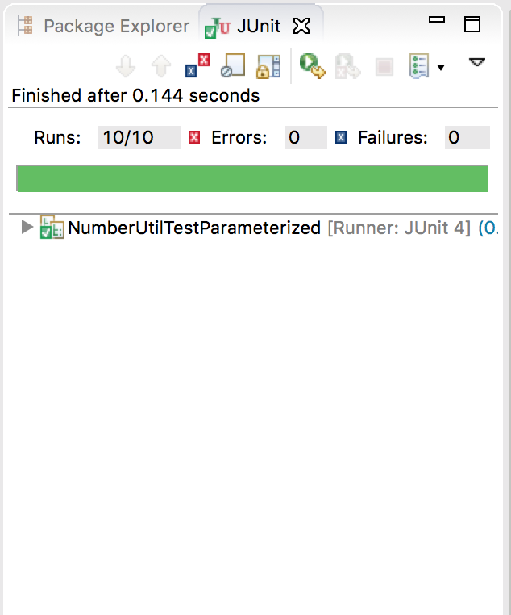

# Unit-Testing-with-JUnit

Testing a set of methods (max and sum) using JUnit

## Requirements

#### Complete NumberUtil.java
- [x] Implement the max and sum methods using streams.
- [x] In these methods, throw an exception if the list is empty.

#### Write a JUnit Test Class
- [x] Install JUnit on your system. Test that it is working properly by using the code from class.
- [x] Write a test class to test the sum and max methods. 
   - Include a robust set of test cases. 
   - Think about what cases should be included- particularly for the max method.
   - Include method(s) to test that the exception is correctly thrown.
   -  Consider using parameterized testing. (This is not required.)
   
 ## JUnit Results
 
